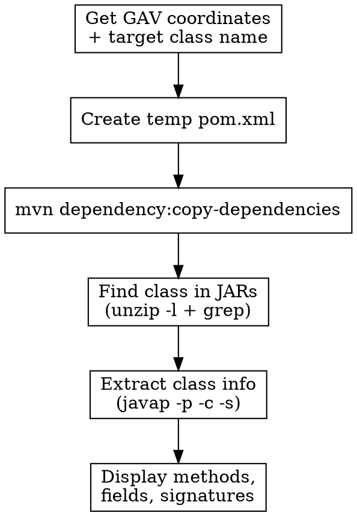

# Maven Class Analyzer

## Overview
Analyze Java classes in Maven dependencies using shell commands. Extract class information, method signatures, and field declarations from JAR files without Python code.

## When to Use

Use this skill when:
- Need to find a specific class in Maven dependencies
- Want to inspect method signatures and parameters in a JAR file
- Need to analyze class structure (fields, methods, interfaces)
- Debugging Maven dependency issues and need class details
- Verifying if a class exists in a specific artifact version

Do NOT use when:
- Analyzing local Java source code (use standard code search)
- Need full decompilation (use dedicated decompiler tools)

## Core Workflow



## Implementation Steps

### Step 1: Create Temporary POM

Create `pom.xml` with dependency configuration:

```bash
mkdir -p maven_temp
cat > maven_temp/pom.xml << 'EOF'
<?xml version="1.0" encoding="UTF-8"?>
<project xmlns="http://maven.apache.org/POM/4.0.0"
         xmlns:xsi="http://www.w3.org/2001/XMLSchema-instance"
         xsi:schemaLocation="http://maven.apache.org/POM/4.0.0 
         http://maven.apache.org/xsd/maven-4.0.0.xsd">
    <modelVersion>4.0.0</modelVersion>
    
    <groupId>temp.analyzer</groupId>
    <artifactId>class-analyzer</artifactId>
    <version>1.0-SNAPSHOT</version>
    
    <dependencies>
        <dependency>
            <groupId>GROUP_ID</groupId>
            <artifactId>ARTIFACT_ID</artifactId>
            <version>VERSION</version>
        </dependency>
    </dependencies>
</project>
EOF
```

Replace `GROUP_ID`, `ARTIFACT_ID`, `VERSION` with actual values.

### Step 2: Download Dependencies

```bash
cd maven_temp
mvn dependency:copy-dependencies -DoutputDirectory=./lib -DincludeScope=compile
```

This downloads all JARs to `maven_temp/lib/` directory.

### Step 3: Find Target Class in JARs

Search for the class file in all downloaded JARs:

```bash
# Find which JAR contains the class
for jar in lib/*.jar; do
    echo "Searching in: $(basename $jar)"
    unzip -l "$jar" | grep -i "ClassName.class" && echo "  Found in: $jar"
done
```

Or use a more efficient one-liner:

```bash
find lib -name "*.jar" -exec sh -c 'unzip -l "$1" | grep -qi "ClassName.class" && echo "Found in: $1"' _ {} \;
```

### Step 4: Extract and Analyze Class

Once you find the JAR containing the class:

```bash
# Extract the specific class file
JAR_PATH="lib/commons-lang3-3.12.0.jar"
CLASS_PATH="org/apache/commons/lang3/StringUtils.class"

unzip -p "$JAR_PATH" "$CLASS_PATH" > /tmp/extracted.class

# Analyze with javap (shows methods, fields, signatures)
javap -p -c -s -constants /tmp/extracted.class
```

**javap flags:**
- `-p`: Show all classes and members (including private)
- `-c`: Disassemble code (show bytecode)
- `-s`: Show internal type signatures
- `-constants`: Show static final constants

### Step 5: Quick Analysis Without Extraction

Directly analyze from JAR:

```bash
# List all classes in JAR
unzip -l "$JAR_PATH" | grep "\.class$"

# Analyze specific class directly
javap -classpath "$JAR_PATH" -p -s org.apache.commons.lang3.StringUtils
```

## Quick Reference Commands

| Task | Command |
|------|---------|
| List all classes in JAR | `unzip -l file.jar \| grep "\.class$"` |
| Find class in JARs | `find . -name "*.jar" -exec unzip -l {} \; \| grep ClassName` |
| Show public methods only | `javap -classpath file.jar com.example.ClassName` |
| Show all members | `javap -classpath file.jar -p com.example.ClassName` |
| Show method signatures | `javap -classpath file.jar -s com.example.ClassName` |
| Show method bytecode | `javap -classpath file.jar -c com.example.ClassName` |
| Get JAR dependencies | `mvn dependency:tree` |
| Download single dependency | `mvn dependency:get -Dartifact=groupId:artifactId:version` |

## Complete Example

Analyzing `StringUtils` from `commons-lang3:3.12.0`:

```bash
# 1. Create POM
mkdir -p maven_temp && cd maven_temp
cat > pom.xml << 'EOF'
<?xml version="1.0" encoding="UTF-8"?>
<project xmlns="http://maven.apache.org/POM/4.0.0">
    <modelVersion>4.0.0</modelVersion>
    <groupId>temp</groupId>
    <artifactId>analyzer</artifactId>
    <version>1.0</version>
    <dependencies>
        <dependency>
            <groupId>org.apache.commons</groupId>
            <artifactId>commons-lang3</artifactId>
            <version>3.12.0</version>
        </dependency>
    </dependencies>
</project>
EOF

# 2. Download
mvn dependency:copy-dependencies -DoutputDirectory=./lib

# 3. Find class
unzip -l lib/commons-lang3-3.12.0.jar | grep StringUtils.class

# 4. Analyze
javap -classpath lib/commons-lang3-3.12.0.jar -p -s org.apache.commons.lang3.StringUtils
```

## Output Interpretation

### javap Output Structure

```
Compiled from "StringUtils.java"
public class org.apache.commons.lang3.StringUtils {
  // Field declarations
  public static final java.lang.String EMPTY;
    descriptor: Ljava/lang/String;
  
  // Constructor
  public org.apache.commons.lang3.StringUtils();
    descriptor: ()V
  
  // Method
  public static boolean isEmpty(java.lang.CharSequence);
    descriptor: (Ljava/lang/CharSequence;)Z
    Code:
      0: aload_0
      1: ifnull 12
      ...
}
```

### Type Descriptors

| Descriptor | Java Type |
|------------|-----------|
| `Z` | boolean |
| `B` | byte |
| `C` | char |
| `S` | short |
| `I` | int |
| `J` | long |
| `F` | float |
| `D` | double |
| `V` | void |
| `Lclassname;` | Object reference |
| `[type` | Array |

**Method descriptor format:** `(ParameterTypes)ReturnType`

Examples:
- `()V` → `void method()`
- `(I)Z` → `boolean method(int)`
- `(Ljava/lang/String;)I` → `int method(String)`

## Common Mistakes

### Mistake 1: Wrong class path format

❌ **Wrong:**
```bash
javap -classpath lib/app.jar com/example/MyClass
```

✅ **Correct:**
```bash
javap -classpath lib/app.jar com.example.MyClass
```

Use dots (`.`) not slashes (`/`) for class names.

### Mistake 2: Missing -p flag

Without `-p`, javap only shows public members:

```bash
# Shows only public
javap -classpath lib/app.jar MyClass

# Shows all including private
javap -classpath lib/app.jar -p MyClass
```

### Mistake 3: Analyzing inner classes

Inner classes use `$` separator:

```bash
# Parent class
javap com.example.Outer

# Inner class
javap com.example.Outer\$Inner
```

Escape the `$` in shell commands.

### Mistake 4: Not checking transitive dependencies

The class might be in a transitive dependency:

```bash
# See full dependency tree
mvn dependency:tree

# Download all including transitive
mvn dependency:copy-dependencies -DincludeScope=compile
```

## Handling Special Cases

### SNAPSHOT Versions

Add repository configuration to pom.xml:

```xml
<repositories>
    <repository>
        <id>snapshots</id>
        <url>https://your-repo/snapshots</url>
        <snapshots>
            <enabled>true</enabled>
        </snapshots>
    </repository>
</repositories>
```

### Private Maven Repositories

Configure in `~/.m2/settings.xml`:

```xml
<servers>
    <server>
        <id>private-repo</id>
        <username>your-username</username>
        <password>your-password</password>
    </server>
</servers>
```

### Multiple Dependencies

Add multiple `<dependency>` blocks in pom.xml:

```xml
<dependencies>
    <dependency>
        <groupId>group1</groupId>
        <artifactId>artifact1</artifactId>
        <version>1.0</version>
    </dependency>
    <dependency>
        <groupId>group2</groupId>
        <artifactId>artifact2</artifactId>
        <version>2.0</version>
    </dependency>
</dependencies>
```

## Real-World Impact

**Use cases:**
- Quickly verify if a method exists in a dependency version
- Debug NoSuchMethodError by comparing method signatures
- Understand API changes between dependency versions
- Find the exact JAR containing a conflicting class
- Extract method parameter names for documentation
